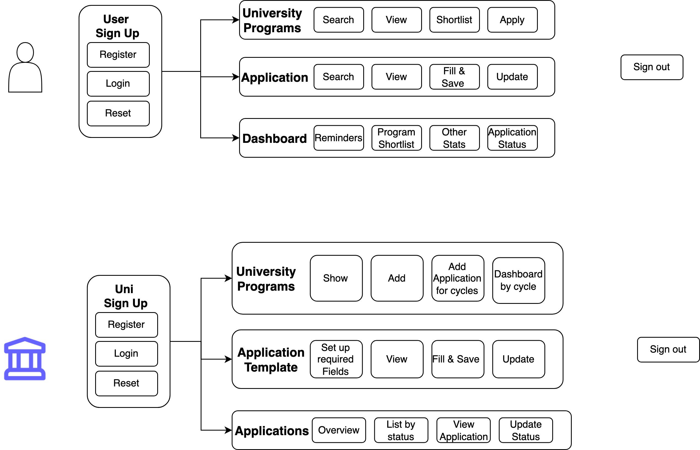

# INFO6150 - Final Project 🚀

**Team Byte Me **

## 👓 Team Members

1. Aditya
2. Avaneesh
3. Kashish
4. Swapnil

REST API service : "backend" directory
Web apps: "client" and "client-admin"

## 🔊 Problem Statement

An University application portal that allows **Students** to plan, apply & track applications & **Universities** to look at students applications.

**Installation Steps**
1. Clone the repo
2. Inside the repo, "cd backend" and "npm install"
3. "cd client" and "npm install"
4. "cd client-admin" and npm install

**Start Steps**
1. cd backend && npm run server
2. cd client && npm start
3. cd client-admin && npm start

## 📜 User Requirements/Features

Note: Italicized requirements are not for MVP

**As a Student I should be able to:**

1. Sign up to the portal
2. Login to the Portal
3. Fill & Update in my basic details that could ease application process
4. Shortlist Various Universities
5. Autofill the already available information
6. Apply to different universities on the portal, save(put) and submit(post)
7. Withdraw application (Delete)
8. View submitted applications
9. _Add Application documents & progress for universities I'm applying outside the portal_
10. View Dashboard to track progress

**As a University:**

1. Sign up to the portal from an admin
2. View dashboard that gives an update on what's happening with applications across various programs.
3. Able to move application through various stages i.e Pending, In Review, Accepted, Rejected

## MVP

**Student**

1. SignUp & Login
2. Profile Information Forms - Post Signup
3. View Programs
4. Create, Update, Delete, Submit Application
5. Application Dashboard

**University User**

1. SignUp & Login
2. Review, Accept, Reject Applications

**Folders**
1. Backend
2. Client
3. Client-admin

Backend is implemented using MVC architecture. Models are created using mongoose library and connected with the cloud database (MongoDb atlas). CRUD operations for student, university, application have been created.

Frontend (client and client-admin) : Redux has been used to handle global state management. Reducers and actions have been created for student auth, application, university.
Multer package is used for handling file i/o and bcryptjs to store the hashed password in the db.

## 📦 Domain Model

## 🖇️ Useful Links

- [Color Schema](https://colorkit.co/color-palette-generator/e6a900-ffbc00-b38400-ffeebf-ffde80/)
